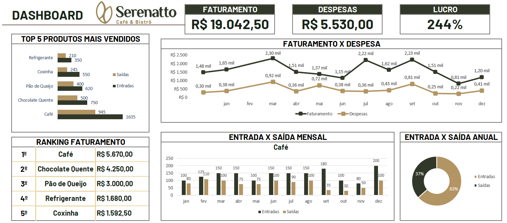

# Dashboard de Estoque e Vendas — Serenatto Café & Bistrô

Comprar bem não é comprar mais.  
É comprar o que vende.

## Sobre o projeto

Este dashboard foi criado para ajudar o Serenatto Café & Bistrô a entender se as compras estão acompanhando o comportamento das vendas.

Em pequenos negócios, cada produto parado no estoque representa capital imobilizado, risco de perda e menor eficiência operacional. A proposta do projeto é transformar dados de entrada, saída, faturamento e despesas em uma visão simples para apoiar decisões de compra mais inteligentes.

## Pergunta de negócio

**As compras estão alinhadas com as vendas?**

Essa é a pergunta central do dashboard. Ao comparar entradas e saídas por produto e por mês, o gestor consegue identificar onde há equilíbrio, excesso de compra ou oportunidade de reposição.

## Principais análises

- Produtos com maior volume de venda
- Comparativo entre entradas e saídas
- Evolução mensal de faturamento e despesas
- Visão geral de faturamento, despesas e lucro
- Identificação de produtos com maior movimentação

## Storytelling dos dados

O dashboard conta uma história simples: **estoque precisa girar**.

Quando a compra não acompanha a venda, o negócio pode ficar sem produto.  
Quando a compra supera a venda sem necessidade, o dinheiro fica parado.

Com essa análise, o gestor consegue sair da compra por intuição e passar para uma compra orientada por dados, priorizando os produtos que realmente vendem e controlando melhor os recursos do negócio.

## Ferramenta utilizada

- Microsoft Excel

## Conclusão

Este projeto mostra como o Excel pode apoiar decisões práticas de negócio. Mais do que visualizar números, o objetivo é ajudar a comprar com inteligência, reduzir estoque parado e direcionar recursos para os produtos com maior saída.
